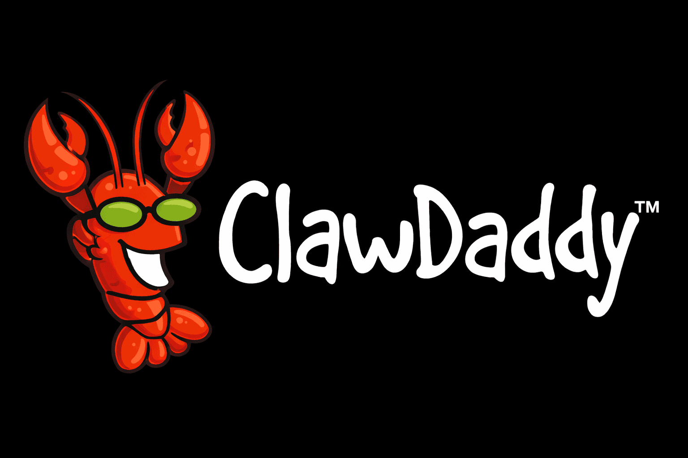

<p align="center">
  <a href="https://clawdaddy.app">
    
  </a>
</p>

<h1 align="center">ClawDaddy MCP Server</h1>

<p align="center">
  <strong>The World's #1 AI-Friendly Domain Registrar</strong><br>
  Check availability, purchase domains, manage DNS - all without CAPTCHAs.
</p>

<p align="center">
  <a href="https://clawdaddy.app">Website</a> ·
  <a href="https://clawdaddy.app/llms.txt">API Docs</a> ·
  <a href="https://www.npmjs.com/package/clawdaddy-mcp">npm</a>
</p>

---

## Features

- **Domain Lookup** - Check availability and pricing instantly
- **Domain Purchase** - Buy domains with USDC (x402) or credit card (Stripe)
- **DNS Management** - Full CRUD for A, AAAA, CNAME, MX, TXT, NS, SRV records
- **Nameserver Control** - Point to Cloudflare, Vercel, Netlify, or any provider
- **Domain Settings** - Manage transfer lock, auto-renew, and privacy
- **Transfer Support** - Get auth codes to move domains to other registrars
- **Token Recovery** - Recover lost management tokens via email

No CAPTCHAs. No signup for lookups. Bearer tokens for management.

## Installation

### Claude Desktop

Add to your `~/Library/Application Support/Claude/claude_desktop_config.json`:

```json
{
  "mcpServers": {
    "clawdaddy": {
      "command": "npx",
      "args": ["-y", "clawdaddy-mcp"]
    }
  }
}
```

Restart Claude Desktop after saving.

### Manual Installation

```bash
npm install -g clawdaddy-mcp
```

## Available Tools

### Lookup Tools (No Auth Required)

| Tool | Description |
|------|-------------|
| `lookup_domain` | Check if a domain is available with pricing |
| `get_quote` | Get purchase quote with payment options |
| `purchase_domain` | Buy a domain (Stripe or x402/USDC) |

### Management Tools (Requires Token)

| Tool | Description |
|------|-------------|
| `get_domain_info` | Get domain overview, nameservers, settings |
| `list_dns_records` | List all DNS records |
| `add_dns_record` | Create A, AAAA, CNAME, MX, TXT, NS, SRV records |
| `update_dns_record` | Modify existing DNS records |
| `delete_dns_record` | Remove DNS records |
| `get_nameservers` | Get current nameservers |
| `set_nameservers` | Update nameservers (Cloudflare, Vercel, etc.) |
| `get_settings` | Get lock, auto-renew, privacy settings |
| `update_settings` | Change domain settings |
| `get_transfer_code` | Get auth code for domain transfer |
| `recover_token` | Recover lost management token |

## Usage Examples

### Check Domain Availability

```
User: Is coolstartup.com available?
Claude: [Uses lookup_domain tool]
  Domain: coolstartup.com
  Status: AVAILABLE
  Available: Yes
  Purchase Price: $12.99/year
  Renewal Price: $19.99/year
```

### Purchase a Domain with USDC

```
User: Buy coolstartup.com with USDC
Claude: [Uses purchase_domain with method=x402]

First call returns payment requirements:
  Payment Required for domain purchase

  x402 Payment Details:
    Network: eip155:8453 (Base)
    Amount: 12.99 USDC
    Pay To: 0x...
    Asset: 0x833589fCD6eDb6E08f4c7C32D4f71b54bdA02913 (USDC)

After payment, call again with transaction hash:
  Domain Registered Successfully!

  Domain: coolstartup.com
  Registration ID: 12345
  Expires: 2027-02-03T10:30:00.000Z

  *** IMPORTANT - SAVE THIS TOKEN ***
  Management Token: clwd_abc123xyz789...
```

### Configure DNS

```
User: Point coolstartup.com to my server at 123.45.67.89
Claude: [Uses add_dns_record tool]
  DNS Record Created:
  [1] @ A 123.45.67.89 TTL:300

User: Add a www subdomain too
Claude: [Uses add_dns_record tool]
  DNS Record Created:
  [2] www CNAME coolstartup.com TTL:300
```

### Point to Cloudflare

```
User: Use Cloudflare nameservers for coolstartup.com
Claude: [Uses set_nameservers tool]
  Nameservers updated!

  Nameservers for coolstartup.com:
    - ns1.cloudflare.com
    - ns2.cloudflare.com
```

## Payment Methods

### x402 (USDC on Base) - For AI Agents

1. Call `purchase_domain` with `method: "x402"`
2. Receive HTTP 402 with payment requirements
3. Send USDC to the specified wallet on Base network
4. Call `purchase_domain` again with `payment_proof: "<tx_hash>"`
5. Receive management token

### Stripe (Credit Card) - For Humans

1. Call `purchase_domain` with `method: "stripe"`
2. Receive checkout URL
3. Complete payment on Stripe
4. Management token sent via email

## Management Tokens

After purchase, you receive a management token (`clwd_xxx...`). This token is required for all domain management operations.

**Important:**
- Save your token immediately - it cannot be retrieved without recovery
- Token recovery generates a new token and invalidates the old one
- Use `recover_token` with your email or wallet address if lost

## Current Promotion

**Lobster Launch Special: $0 Service Fee!**

During our launch, ClawDaddy charges zero markup. You pay exactly what we pay to the registrar.

## API Architecture

```
Claude Desktop
    |
    v
ClawDaddy MCP Server (this package)
    |
    v
ClawDaddy.app API
    |
    v
Name.com (Registrar)
```

## Troubleshooting

**Tool not found**
- Restart Claude Desktop after configuration changes

**401 Unauthorized**
- Check that your management token is correct
- Tokens start with `clwd_`

**Domain not available**
- The domain may have been registered since your last check
- Use `lookup_domain` to verify current status

**Rate limiting**
- Free service has reasonable-use limits
- Wait and retry if you see 429 errors

## License

MIT

---

Built with claws by [ClawDaddy.app](https://clawdaddy.app)
